[](https://github.com/alexisml/ha-ev-charger-balancer/actions/workflows/tests.yml)
[](https://codecov.io/gh/alexisml/ha-ev-charger-balancer)
[](https://github.com/alexisml/ha-ev-charger-balancer/actions/workflows/codeql.yml)
[](https://github.com/alexisml/ha-ev-charger-balancer/actions/workflows/ruff.yml)
[](https://github.com/alexisml/ha-ev-charger-balancer/actions/workflows/type-check.yml)
[](https://github.com/alexisml/ha-ev-charger-balancer/actions/workflows/spell-check.yml)
[](https://github.com/alexisml/ha-ev-charger-balancer/actions/workflows/gitleaks.yml)
[](https://github.com/alexisml/ha-ev-charger-balancer/blob/main/.github/dependabot.yml)

# EV Charger Load Balancing (HACS)

A custom Home Assistant integration (HACS) that provides dynamic load balancing for EV chargers, using a power meter and the lbbrhzn/ocpp integration.

This project gives Home Assistant users a native, no-helper-required solution to limit charging current to an EV charger based on a whole-home power meter, household limits, and user preferences.

---

> ⚠️ **DISCLAIMER — Use at your own risk.**
>
> This integration is provided **as-is**, without any warranty of any kind, express or implied. Installing and running this software may affect your EV charger, home electrical circuit, and connected devices. You are solely responsible for any consequences that result from its use.
>
> You are free to **review, test, and audit** the source code before using it. Contributions, bug reports, and security disclosures are welcome.

---

> ⚠️ **Current limitation (PR-1):** This integration currently supports **one charger per instance**. Multiple-charger support with per-charger prioritization is planned for Phase 2 (post-MVP). Multiple instances of this integration are not supported — only one config entry can be created. See the [MVP plan](docs/documentation/milestones/01-2026-02-19-mvp-plan.md) and the [multi-charger plan](docs/documentation/milestones/02-2026-02-19-multi-charger-plan.md) for details.

Status: In development — custom integration (PR-1 through PR-6-MVP complete; working toward PR-7-MVP: HACS release)

## Why a custom integration?

During prototyping we evaluated AppDaemon apps and automation blueprints as potential delivery mechanisms. Both were rejected for the same reason: **every runtime-configurable parameter (service current, voltage, charger limits, enable toggle) must be a manually created `input_number` / `input_boolean` helper** because neither AppDaemon nor blueprints can create Config Entries in HA.

A **custom HACS integration with Config Flow** solves this:

- **No manual helper creation** — the user configures everything through Settings → Integrations → Add (a guided UI).
- **Native HA entities** — the integration registers `number`, `switch`, `sensor`, and `binary_sensor` entities linked to a proper device in Settings → Devices.
- **Persistent state** — config entries and entity states survive HA restarts.
- **Multi-charger support** *(planned)* — future options flow will handle adding/removing chargers at runtime; currently one charger per instance only.
- **HACS distribution** — install via HACS, configure in the UI, no YAML required.

See [`docs/development-memories/2026-02-19-lessons-learned.md`](docs/development-memories/2026-02-19-lessons-learned.md) for the full evaluation.

## How it works

### Inputs

| Input | Description |
|---|---|
| **Service voltage** (V) | Nominal supply voltage — used to convert power (W) ↔ current (A) |
| **Service current** (A) | Maximum whole-house breaker rating; the system never exceeds this |
| **Power meter** (W) | Real-time total household consumption, including active EV charging |
| **Max charger current** (A) | Per-charger upper limit; can be changed at runtime |
| **Min EV current** (A) | Lowest current at which the charger can operate (IEC 61851: 6 A); below this charging must stop |
| **Ramp-up time** (s) | Cooldown before allowing current to increase after a dynamic reduction (default 30 s) |
| **Unavailable behavior** | What to do when the power meter is unavailable: **stop** (default), **ignore**, or **set current** |
| **Fallback current** (A) | Charging current to use in "set current" mode — capped at the charger maximum to prevent exceeding the physical limit |
| **Actions** | User-supplied scripts: `set_current`, `stop_charging`, `start_charging` — see the [Action Scripts Guide](docs/documentation/action-scripts-guide.md) |
| **Event notifications** | HA bus events fired on fault conditions (meter unavailable, overload, fallback, charging resumed) — see the [Event Notifications Guide](docs/documentation/event-notifications-guide.md) |

---

### Decision loop

The balancer is **event-driven** — it does not poll on a timer. A recomputation is triggered by any of the following events:

| Trigger event | What happens | Latency |
|---|---|---|
| **Power meter state change** | The configured `sensor.*` entity reports a new Watt value. The coordinator reads it and runs the full balancing algorithm. | Instant — runs on the same HA event-loop tick as the state change. |
| **Max charger current changed** | The user (or an automation) changes the `number.max_charger_current` entity. The coordinator re-reads the current power meter value and recomputes immediately. | Instant — no need to wait for the next meter event. |
| **Min EV current changed** | Same as above for `number.min_ev_current`. If the new minimum is higher than the current target, charging stops on this tick. | Instant. |
| **Load balancing re-enabled** | The `switch.enabled` entity is turned back on. The coordinator reads the current power meter value and runs a full recomputation. | Instant. |

> **Note:** When the `switch.enabled` entity is turned **off**, power-meter events are ignored and no recomputation occurs. The charger current is left at its last value until load balancing is re-enabled.

On each trigger, the coordinator runs the following logic:

```mermaid
flowchart TD
    A([Power meter changes])
    A --> B["Compute available headroom<br/>available_a = service_current_a - house_power_w / voltage_v"]
    B --> C["target_a = min(current_ev_a + available_a, max_charger_a)<br/>floor to 1 A step"]
    C --> D{"target_a &lt; min_ev_a?"}
    D -- YES --> E(["stop_charging — instant<br/>charger OFF"])
    D -- NO --> F{"target_a &lt; current_a?<br/>load increased, must reduce"}
    F -- "YES — instant" --> G(["set_current(target_a)"])
    F -- "NO — load decreased" --> H{"ramp-up cooldown elapsed?<br/>time since last reduction ≥ ramp_up_time_s"}
    H -- "YES — allowed" --> I(["set_current(target_a)"])
    H -- NO --> J(["hold current<br/>wait and retry next cycle"])
```



---

### Charger state transitions

```mermaid
stateDiagram-v2
    state "CHARGING (current = target_a)" as CHARGING
    state "STOPPED (charger off)" as STOPPED

    [*] --> STOPPED
    CHARGING --> STOPPED: target_a < min_ev_a — instant
    STOPPED --> CHARGING: target_a ≥ min_ev_a AND ramp-up elapsed (or first start)

    note right of STOPPED
        Resume: start_charging() then set_current(target_a)
    end note
```



Key rules:
- **Reductions are always instant** — the moment household load rises above the limit, the charger current is reduced on the very next power-meter event.
- **Increases are held for `ramp_up_time_s`** after any reduction — this prevents rapid oscillation when load hovers near the service limit.
- **Stopping charging** happens when even the minimum current would exceed the service limit.
- **Resuming charging** happens when the available current rises back above the minimum threshold and the ramp-up cooldown has elapsed.

---

### Balancer operational states

The integration exposes a diagnostic sensor (`sensor.*_balancer_state`) that tracks the coordinator's operational state on every cycle. These states map to the decision loop and charger transitions above:

```mermaid
stateDiagram-v2
    state "STOPPED\ntarget = 0 A" as STOPPED
    state "ADJUSTING\ntarget changed" as ADJUSTING
    state "ACTIVE\nsteady state" as ACTIVE
    state "RAMP_UP_HOLD\ncooldown blocking increase" as RAMP_UP_HOLD
    state "DISABLED\nswitch off" as DISABLED

    [*] --> STOPPED
    STOPPED --> ADJUSTING : headroom ≥ min_ev_a
    ADJUSTING --> ACTIVE : same target next cycle
    ADJUSTING --> STOPPED : overload (target < min_ev_a)
    ADJUSTING --> RAMP_UP_HOLD : increase needed but cooldown active
    ACTIVE --> ADJUSTING : target changed
    ACTIVE --> STOPPED : overload
    ACTIVE --> RAMP_UP_HOLD : increase needed but cooldown active
    RAMP_UP_HOLD --> ADJUSTING : cooldown elapsed
    RAMP_UP_HOLD --> STOPPED : overload
    DISABLED --> STOPPED : re-enabled (no headroom)
    DISABLED --> ADJUSTING : re-enabled (with headroom)
    STOPPED --> DISABLED : switch turned off
    ACTIVE --> DISABLED : switch turned off
    ADJUSTING --> DISABLED : switch turned off
    RAMP_UP_HOLD --> DISABLED : switch turned off
```



---

### Diagnostic sensors

The integration provides several diagnostic sensors for monitoring and automation:

| Entity | Type | Purpose |
|--------|------|---------|
| `sensor.*_balancer_state` | Diagnostic | Operational state: `stopped`, `active`, `adjusting`, `ramp_up_hold`, `disabled` |
| `sensor.*_configured_fallback` | Diagnostic | Configured unavailable behavior: `stop`, `ignore`, or `set_current` |
| `binary_sensor.*_meter_status` | Connectivity | **On** = power meter reporting valid readings. **Off** = unavailable. |
| `binary_sensor.*_fallback_active` | Problem | **On** = meter-unavailable fallback in effect. **Off** = normal operation. |

Together these sensors answer: *What is the balancer doing? Is my meter working? What fallback did I configure? Is that fallback active right now?*

For detailed logging and diagnostics, see the [Logging Guide](docs/documentation/logging-guide.md).

---

### Home Assistant restart

All entity states (sensors, numbers, switch) survive a restart because each entity uses Home Assistant's **RestoreEntity** mechanism. On startup:

1. Sensors restore their last known values (`current_set`, `available_current`).
2. Number entities restore their runtime parameters (`max_charger_current`, `min_ev_current`).
3. The switch restores its `enabled` state.
4. The `current_set` sensor syncs its restored value back into the coordinator so the balancing algorithm continues from where it left off — no spike or drop.
5. The coordinator starts listening for power-meter state changes. The next meter event triggers a normal recomputation.

> **Note:** Between restart completion and the first power meter event, the charger current stays at the last known value. No action is taken until fresh meter data arrives.

---

### Power meter unavailable

When the power meter entity transitions to `unavailable` or `unknown`, the coordinator can no longer compute headroom. The behavior is controlled by the **"When power meter is unavailable"** config setting:

| Mode | Behavior |
|---|---|
| **Stop charging** (default) | Charger is immediately set to 0 A — safest option when meter data is unreliable. |
| **Ignore** | Do nothing — keep the last computed charger current. Useful if brief meter dropouts are common and you don't want to interrupt charging. |
| **Set a specific current** | Apply the configured fallback current, **capped at the charger maximum**. This ensures the fallback never exceeds the physical charger limit. For example: if max charger current is 32 A and the fallback is 50 A, the charger is set to 32 A; if the fallback is 6 A, the charger drops to 6 A. |

When the meter recovers and starts reporting valid values again, normal computation resumes automatically on the next state change.

> **Tip:** The `binary_sensor.*_meter_status` and `binary_sensor.*_fallback_active` sensors let you monitor meter health and fallback activation in dashboards and automations without enabling debug logs. The `sensor.*_configured_fallback` sensor shows which fallback mode is currently configured.

> **Note:** The EV charger device itself is not monitored by this integration. The integration only controls the *target current* it sends; it does not track whether the charger is physically connected or responding. Charger health monitoring is the responsibility of the charger integration (e.g., OCPP).

---

### Multi-charger fairness — planned feature

> ⚠️ **Not yet implemented.** Multi-charger support with per-charger prioritization/weighting is planned for Phase 2 (post-MVP). See [`docs/documentation/milestones/02-2026-02-19-multi-charger-plan.md`](docs/documentation/milestones/02-2026-02-19-multi-charger-plan.md) for the Phase 2 plan. The water-filling algorithm is already unit-tested in `tests/test_load_balancer.py` and will feed into that work.

When multiple chargers are active the available current will be distributed fairly using a water-filling algorithm:

```
Available current pool
────────────────────────────────────────────
   Charger A (max 10 A)  │  Charger B (max 32 A)
   ───────────────────── │  ──────────────────────
   fair share = pool / N │  fair share = pool / N
                         │
   if share ≥ max A      │  gets share
   → cap at 10 A         │
   → unused headroom     │
     returned to pool    │
────────────────────────────────────────────
   Remaining pool re-divided across uncapped chargers
```

1. Divide the pool equally among all active chargers.
2. Chargers that reach their per-charger maximum are capped; the surplus is returned to the pool.
3. Chargers whose share would fall below `min_ev_a` are stopped; they leave the pool.
4. Repeat until all remaining chargers have a valid fair share.

---

## Development docs

- All research, plans and design docs for development MUST be placed under `docs/development-memories/` following the filename convention described in [`docs/development-memories/README.md`](docs/development-memories/README.md).
- See the **MVP plan** (Phase 1 roadmap): [`docs/documentation/milestones/01-2026-02-19-mvp-plan.md`](docs/documentation/milestones/01-2026-02-19-mvp-plan.md)
- See the **multi-charger plan** (Phase 2): [`docs/documentation/milestones/02-2026-02-19-multi-charger-plan.md`](docs/documentation/milestones/02-2026-02-19-multi-charger-plan.md)
- See the current research plan: [`docs/development-memories/2026-02-19-research-plan.md`](docs/development-memories/2026-02-19-research-plan.md)
- See the lessons learned (AppDaemon/blueprint evaluation): [`docs/development-memories/2026-02-19-lessons-learned.md`](docs/development-memories/2026-02-19-lessons-learned.md)
- See development docs README: [`docs/development-memories/README.md`](docs/development-memories/README.md)

## Quick start / Next actions

1. ~~Scaffold `custom_components/ev_lb/` with `manifest.json`, `__init__.py`, `config_flow.py`.~~ ✅ Done (PR-1)
2. ~~Add `sensor.py`, `binary_sensor.py`, `number.py`, `switch.py`.~~ ✅ Done (PR-2)
3. ~~Port the computation core from `tests/` into the integration.~~ ✅ Done (PR-3)
4. ~~Implement `set_current` / `stop_charging` / `start_charging` action execution.~~ ✅ Done (PR-4)
5. Write HA integration tests using `pytest-homeassistant-custom-component`.
6. Publish via HACS.

## Contributing (short tip)

- When adding plans or design docs, follow the docs rule above.
- For code contributions, open PRs against the repository default branch and reference the relevant docs under `docs/development-memories/`.

### Running CI checks locally

**Linting** (requires `ruff`):
```bash
pip install ruff
ruff check .
```

**Type checking** (requires `pyright`):
```bash
pip install pyright
pyright
```

**Spell checking** (requires `codespell`):
```bash
pip install codespell
codespell
```

These tools read their configuration from `pyrightconfig.json` (Pyright) and `pyproject.toml` (Ruff and codespell) at the repo root.

**Secret scanning** (requires [Gitleaks](https://github.com/gitleaks/gitleaks)):
```bash
# macOS
brew install gitleaks
# or download a release binary from https://github.com/gitleaks/gitleaks/releases

gitleaks detect --source . --config .gitleaks.toml
```
To suppress a confirmed false positive on a specific line, append `# gitleaks:allow` to that line.
For path-level suppressions, add the path regex to the `paths` array under the `[allowlist]` table in `.gitleaks.toml`.

**Dependency Review**: this check is GitHub-only and runs automatically on every pull request — no local tooling is required.

For the full research plan, design decisions, and lessons learned, see:
- [`docs/documentation/milestones/01-2026-02-19-mvp-plan.md`](docs/documentation/milestones/01-2026-02-19-mvp-plan.md)
- [`docs/documentation/milestones/02-2026-02-19-multi-charger-plan.md`](docs/documentation/milestones/02-2026-02-19-multi-charger-plan.md)
- [`docs/development-memories/2026-02-19-research-plan.md`](docs/development-memories/2026-02-19-research-plan.md)
- [`docs/development-memories/2026-02-19-lessons-learned.md`](docs/development-memories/2026-02-19-lessons-learned.md)

---

> 🤖 **AI Disclosure**
>
> A significant portion of this project — including code, documentation, and design — was developed with the assistance of AI tools (GitHub Copilot / large-language models). All AI-generated output has been reviewed, but users and contributors should audit the code independently before relying on it in production environments.
