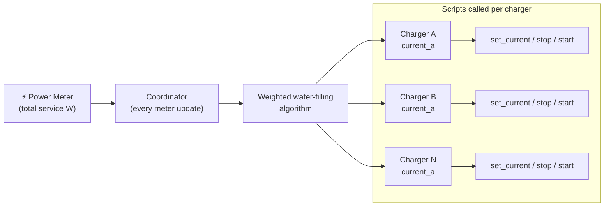
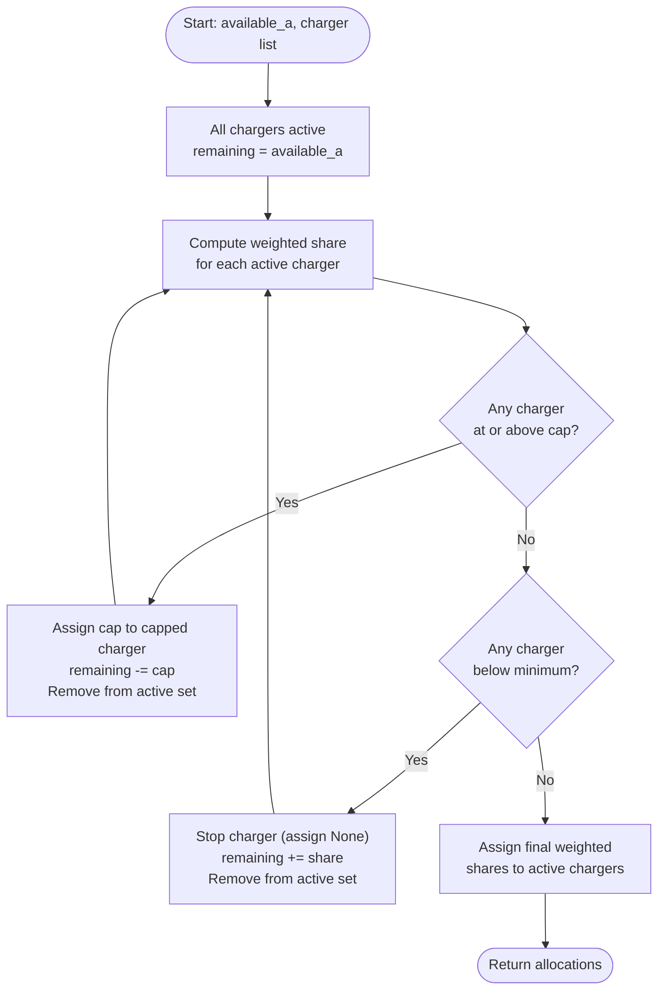
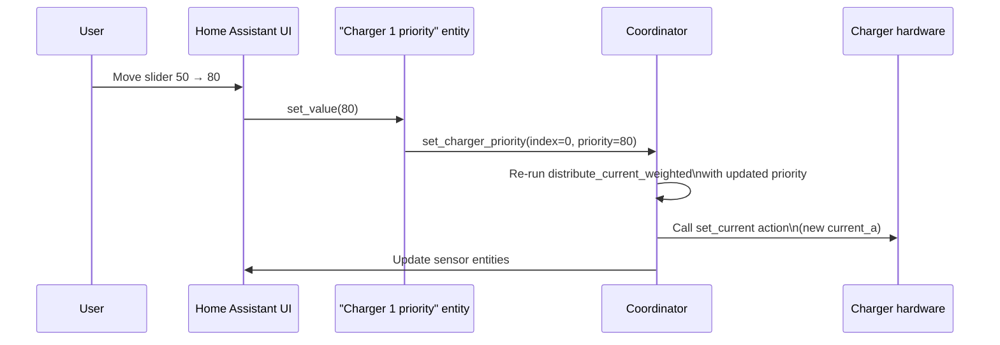

# Multi-Charger Load Balancing

This guide explains how to run multiple EV chargers on a single power meter with Watt-O-Balancer, how the priority system distributes available current across chargers, and how to adjust priorities at runtime.

---

## Overview

A single Watt-O-Balancer instance can control **1 to N EV chargers** on the same electrical circuit. The integration continuously monitors total service power, calculates how much current is available for EV charging, and then splits that current across all configured chargers according to their **priority weights**.



**Key properties:**

- All chargers share the same service headroom — the total current commanded across all chargers never exceeds the available headroom.
- Each charger has independent `min`, `max`, and `priority` settings.
- Chargers that hit their cap or fall below their minimum release their unused headroom to the others.
- Priorities can be changed at runtime without reconfiguring — each charger gets a **Charger N priority** number entity (slider) in the HA device card.

---

## Configuring multiple chargers

Chargers are configured in the **Configure** dialog (gear icon → Settings → Devices & Services → Watt-O-Balancer). The flow visits a global settings step, then one step per charger:

```
init (global settings)
  → charger 1 (scripts, status sensor, priority)
      → [charger 2 → [charger 3 → …]]
          → save
```

Each charger step configures:

| Field | What it does |
|---|---|
| **Set current action** | Script called to set charging current. Receives `current_a`, `charger_id`, and `charger_num`. |
| **Stop charging action** | Script called to stop charging. |
| **Start charging action** | Script called to resume charging. |
| **Charger status sensor** | Sensor whose state equals `Charging` when the EV actively draws current. |
| **Priority** | Weight (0–100, step 5). Controls how available current is shared. Default: 50. |

> To add a charger: open Configure, step through all existing chargers, tick **"Add another charger?"** on the last step, configure the new charger, save.
>
> To remove the last charger: open Configure, stop ticking "Add another charger?" on the charger you want to be the final one, save.

---

## Understanding priority weights

Priority weights are **relative**, not absolute percentages. What matters is the ratio between weights, not the raw numbers:

| Weight A | Weight B | Effect |
|---|---|---|
| 50 | 50 | Equal share — same as no priority configured |
| 60 | 40 | A gets 60%, B gets 40% of available current |
| 1 | 1 | Identical to 50/50 (only ratios matter) |
| 100 | 0 | A gets all current; B is stopped (its weighted share = 0 < min) |
| 0 | 50 | A is stopped; B gets all current |

**Priority 0 = stop that charger.** When a charger's priority is 0, its weighted share is always 0 A — below the minimum EV current — so the integration stops it and redistributes its unused headroom to the other chargers.

---

## The weighted water-filling algorithm

### Simple explanation

Imagine the available current as a pool of water. The algorithm pours water into the charger "cups" proportionally to their weights. If a cup hits its cap (`max_charger_current`) before the pool is empty, the remaining water is re-poured proportionally into the other cups. If a cup can't hold the minimum safe amount (`min_ev_current`), it's removed and its share is returned.

### Algorithm steps



### Redistribution examples

#### Example 1 — Equal distribution, 18 A available, 2 chargers

Both chargers have priority 50, min 6 A, max 32 A.

| | Charger A | Charger B |
|---|---|---|
| Weight | 50 | 50 |
| Weighted share (18 A × 50/100) | 9 A | 9 A |
| Within min/max? | ✅ yes | ✅ yes |
| **Final allocation** | **9 A** | **9 A** |

---

#### Example 2 — Weighted 60/40, 18 A available

Charger A has priority 60, Charger B has priority 40.

| | Charger A | Charger B |
|---|---|---|
| Weight | 60 | 40 |
| Weighted share (18 A) | 18 × 60/100 = **10.8 → 10 A** | 18 × 40/100 = **7.2 → 7 A** |
| Within min/max? | ✅ yes | ✅ yes |
| **Final allocation** | **10 A** | **7 A** |

> Shares are floored to whole Amps (1 A step resolution).

---

#### Example 3 — Cap redistribution, 28 A available

Charger A (weight 60) has a cap of 10 A. Charger B (weight 40) has a cap of 32 A.

| Round | Charger A | Charger B |
|---|---|---|
| **Round 1 shares** | 28 × 60/100 = 16.8 A | 28 × 40/100 = 11.2 A |
| Cap check | 16.8 > 10 A cap → **capped at 10 A** | 11.2 ≤ 32 A → active |
| Remaining after capping A | 28 − 10 = **18 A** | — |
| **Round 2 shares (B only)** | — | 18 A (all remaining) |
| **Final allocation** | **10 A** | **18 A** |

---

#### Example 4 — Below-minimum stop, 10 A available

Charger A (weight 60), Charger B (weight 40). Both have min 6 A.

| Round | Charger A | Charger B |
|---|---|---|
| **Round 1 shares** | 10 × 60/100 = 6 A | 10 × 40/100 = 4 A |
| Min check | 6 A = min ✅ | 4 A < 6 A min → **stopped** |
| Remaining | 10 A | — |
| **Round 2 shares (A only)** | 10 A | — |
| **Final allocation** | **10 A** | **stopped** |

Charger A's higher priority keeps it running; Charger B would receive an unsafe current so it stops.

---

#### Example 5 — All chargers stop

With only 11 A available and both chargers at equal priority 50/50:

| | Charger A | Charger B |
|---|---|---|
| Round 1 shares | 5.5 → 5 A | 5.5 → 5 A |
| Min check | 5 A < 6 A → **stopped** | 5 A < 6 A → **stopped** |
| **Final allocation** | **stopped** | **stopped** |

Equal priority means neither charger wins over the other. With insufficient headroom for a fair split, both stop rather than letting one charger monopolize.

---

#### Summary table — impact of available current on two equal-priority chargers (min 6 A, max 32 A)

| Available (A) | Charger A | Charger B | Notes |
|---|---|---|---|
| ≥ 12 | ≥ 6 A | ≥ 6 A | Both active |
| 12 | 6 A | 6 A | Both at minimum |
| 11 | stopped | stopped | 5.5 A each < 6 A min |
| 6 | stopped | stopped | 3 A each < 6 A min |
| 0 | stopped | stopped | No headroom |

#### Summary table — impact on 60/40 weighted chargers (min 6 A, max 32 A)

| Available (A) | Charger A (60) | Charger B (40) | Notes |
|---|---|---|---|
| 28 | 16 A | 11 A | Both well within caps |
| 15 | 9 A | 6 A | B at minimum |
| 14 | 14 A | stopped | B's share (5.6→5 A) < min; A absorbs all |
| 10 | 10 A | stopped | A at minimum, B stopped |
| 9 | stopped | stopped | A's share (5.4→5 A) < min; all stop |

---

## Three-charger example

With three chargers at weights 60 / 30 / 10 and 10 A available (min 6 A):


| Charger | Weight | Round 1 share | Min check | Final |
|---|---|---|---|---|
| A | 60 | 10 × 60/100 = 6 A | 6 A = min ✅ | **10 A** (absorbs all after B/C stop) |
| B | 30 | 10 × 30/100 = 3 A | 3 A < 6 A → ❌ stop | **stopped** |
| C | 10 | 10 × 10/100 = 1 A | 1 A < 6 A → ❌ stop | **stopped** |

---

## Runtime priority adjustment (on-the-fly)

Each charger gets a dedicated **Charger N priority** number entity visible in the HA device card and in the Entities list. You can change it at any time — no Configure dialog, no restart.



The value persists across Home Assistant restarts via `RestoreNumber`. On first start after configuration, the entity is seeded from the configured priority; any runtime change takes precedence from that point forward.

### Example: shifting priority during a session

You have two chargers at equal priority (50/50). You want to charge your work car faster before a trip:

1. Open the **EV Charger Load Balancer** device card.
2. Set **Charger 1 priority** to **80**, **Charger 2 priority** to **20**.
3. The integration immediately reallocates: Charger 1 gets 80% of available headroom, Charger 2 gets 20%.
4. After the trip, restore both to **50** for equal charging again.

---

## Per-charger entities

Each configured charger gets a priority number entity in the device card:

| Entity | What it shows |
|---|---|
| `number.*_charger_N_priority` | Priority weight (0–100, step 5) — adjustable at runtime |

> **Note:** Per-charger `sensor.*_charger_N_current_set` entities are not yet exposed. Each charger's commanded current is tracked internally and executed via its configured action scripts. A global `sensor.*_current_set` (the aggregate total across all chargers) is available via the standard entity list.

Global entities (one per integration instance) remain the same as for single-charger setups — see [How It Works — Entities reference](02-how-it-works.md#entities-reference).

---

## Action scripts in multi-charger setups

Each charger's action scripts receive two variables to identify which charger the call is for:

| Variable | Type | Value |
|---|---|---|
| `charger_id` | string | Config entry ID (same for all chargers — backward compatible) |
| `charger_num` | integer | 1-based charger index (1 = first charger, 2 = second, …) |
| `current_a` | float | Target current in Amps (for set-current action only) |

You can use **one shared script** for multiple chargers by branching on `charger_num`:

```yaml
# Example: single OCPP set-current script serving 2 chargers
script:
  ev_set_current:
    sequence:
      - choose:
          - conditions: "{{ charger_num == 1 }}"
            sequence:
              - action: ocpp.set_charge_rate
                data:
                  entity_id: sensor.chargepoint_A_status_connector
                  limit_amps: "{{ current_a | int }}"
          - conditions: "{{ charger_num == 2 }}"
            sequence:
              - action: ocpp.set_charge_rate
                data:
                  entity_id: sensor.chargepoint_B_status_connector
                  limit_amps: "{{ current_a | int }}"
```

Or you can create **separate scripts** per charger — whichever is cleaner for your setup.

> **Note:** The duplicate-status-sensor validation in the Configure dialog prevents the same charger status sensor from being assigned to two different chargers, whether in the same instance or across multiple Watt-O-Balancer instances.

---

## Next steps

- [Installation & Setup](01-installation-and-setup.md) — add your first charger or reconfigure an existing setup
- [How It Works](02-how-it-works.md) — single-charger algorithm, entities reference, safety behavior
- [Action Scripts Guide](04-action-scripts-guide.md) — detailed script examples for OCPP, REST, Modbus, and switch chargers
