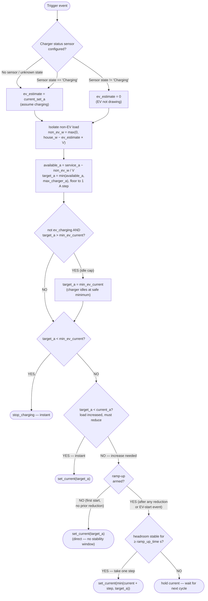
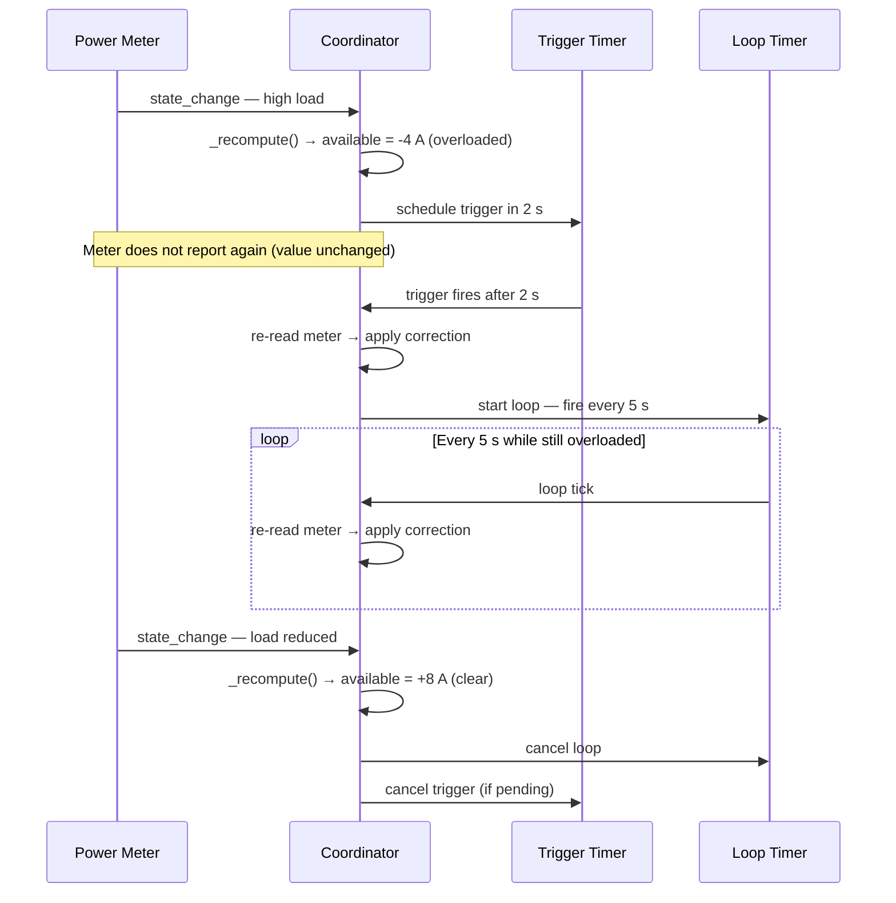
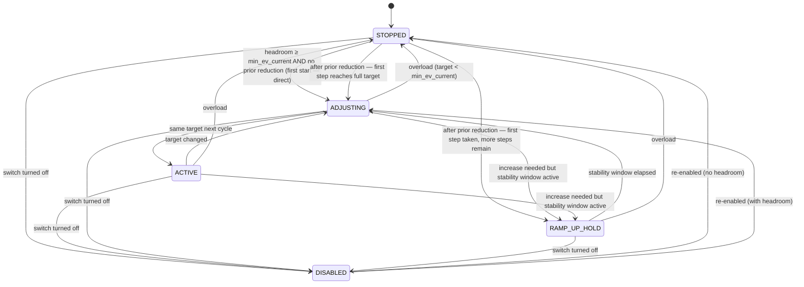
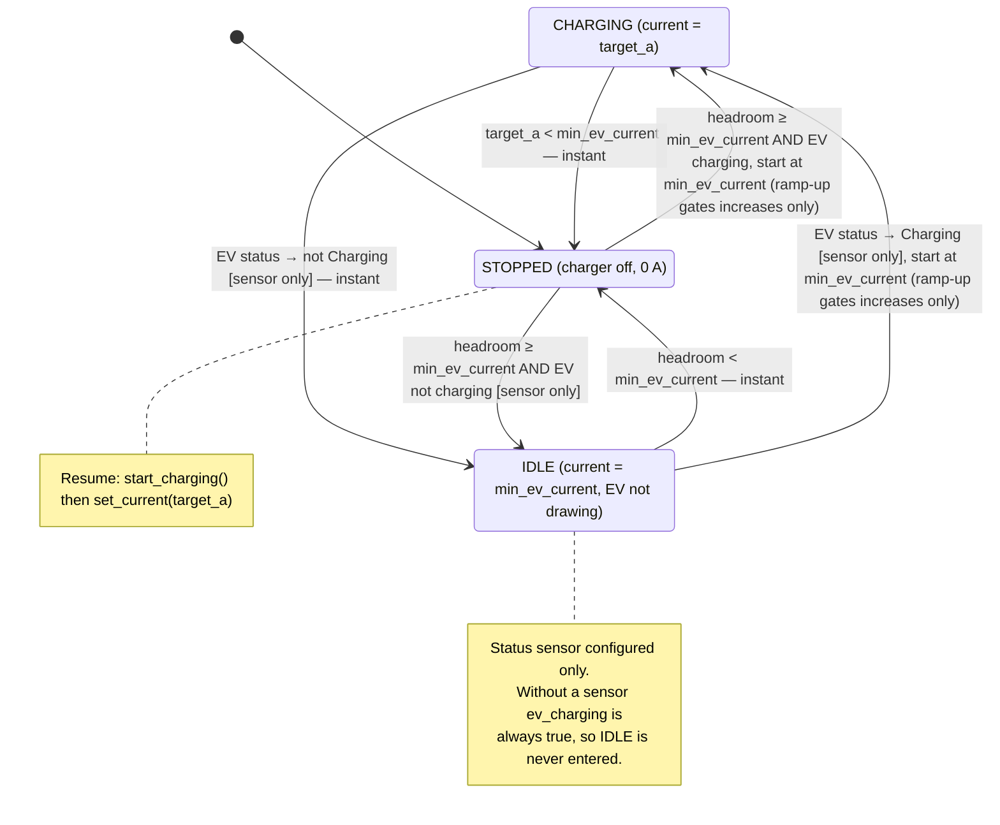
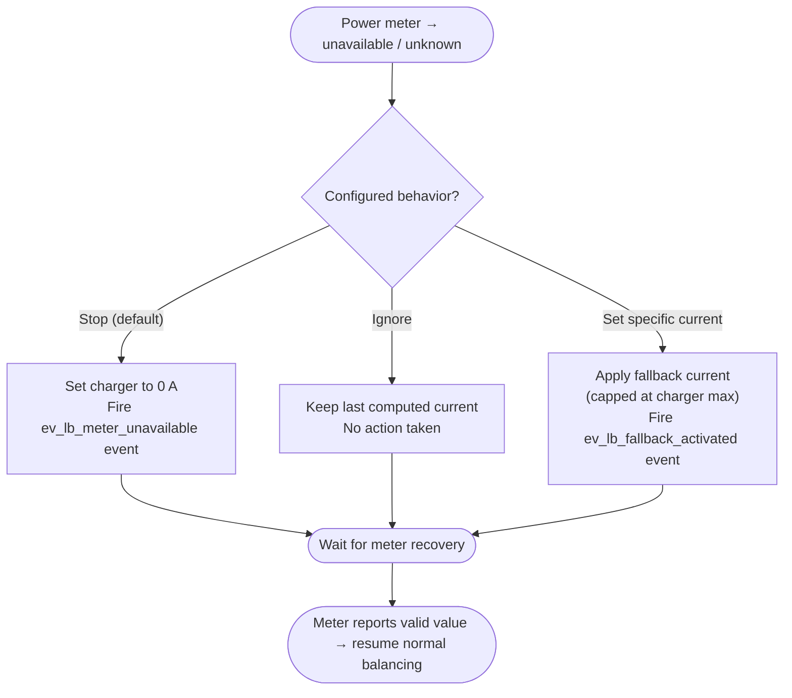
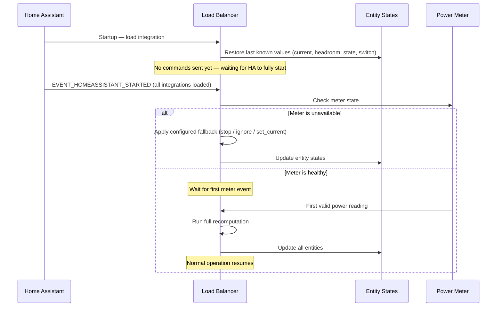
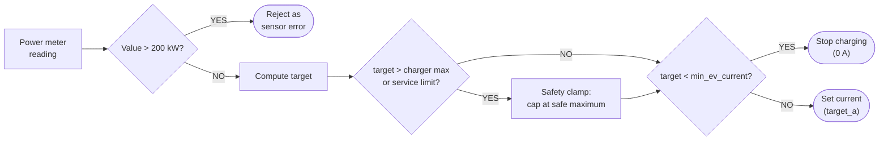

# How It Works

This guide explains what the integration does, what you can expect from it, what it does **not** do, and the technical details of how it balances your EV charger's current.

---

## The short version

The integration watches your home's power meter. When your total service power changes, it instantly recalculates how much current your EV charger can safely use without exceeding your service limit. If the load goes up, the charger current goes down — immediately. If the load goes down, the charger current goes back up — in gradual steps, once headroom has been stably available for a configurable window, to prevent oscillation.

That's it. It's a reactive, real-time load balancer for a single EV charger.

---

## What to expect

- **Automatic current adjustment.** You plug in your EV, and the integration continuously adjusts the charging current based on what the rest of your house is consuming. No manual intervention needed.
- **Safety-first behavior.** If something goes wrong (meter unavailable, overload), the default response is to stop or reduce charging immediately.
- **Dashboard visibility.** The integration creates several sensor entities so you can see exactly what it's doing — current being set, available headroom, balancer state, meter health — all visible in the HA dashboard.
- **Event notifications.** When faults occur (overload, meter lost, fallback activated), the integration fires HA events and creates persistent notifications. You can build automations on these to get mobile alerts.
- **State survives restarts.** All entity states are restored after a Home Assistant restart. The charger current stays at its last known value until fresh meter data arrives.

---

## What NOT to expect

- **This is not a charger driver.** The integration does not communicate directly with your charger hardware. It computes the optimal current and calls user-configured scripts to execute the commands. If your scripts are wrong or your charger integration is broken, the integration can't fix that.
- **This does not monitor charger health.** The integration has no way to know if your charger is physically connected, responding, or actually applying the current it's told to set. Charger health monitoring is the responsibility of your charger integration (e.g., OCPP).
- **This does not provide circuit-level protection.** The integration is a software load balancer. It is not a replacement for proper electrical protection (breakers, fuses, RCDs). Always ensure your electrical installation meets local codes.
- **Each instance controls one charger on one circuit.** Add a separate instance for each power meter / circuit you want to balance. The integration prevents the same power meter from being added twice — if you try, the setup wizard will show an "already configured" error. Multi-charger support within a single instance (with per-charger prioritization) is planned for [Phase 2](milestones/02-2026-02-19-multi-charger-plan.md).
- **This assumes a single-phase electrical supply.** All Watt ↔ Amp conversions use `P = V × I`. Three-phase installations require workarounds — see [Single-phase assumption and multi-phase installations](#single-phase-assumption-and-multi-phase-installations).
- **This does not manage time-of-use tariffs or solar surplus directly.** The integration exclusively handles load balancing — it reacts to total metered power to prevent exceeding your service limit. However, it works well **alongside** external automations that handle these concerns. See [Combining with solar surplus or time-of-use tariffs](#combining-with-solar-surplus-or-time-of-use-tariffs) below.
- **Current adjustments are in 1 A steps.** The integration floors all current values to whole Amps. Sub-amp precision is not supported.
- **Increases are stepped and delayed.** After any current reduction, recovery is gradual: each step requires the computed headroom to be **continuously sufficient for a stability window** (default: **15 s**, adjustable via `number.*_ramp_up_time`) and only adds at most **`ramp_up_step_a`** Amps per step (default: **4 A**, adjustable via `number.*_ramp_up_step`). This is intentional — it prevents rapid oscillation when service load fluctuates near the service limit.

### Combining with solar surplus or time-of-use tariffs

The integration focuses exclusively on **load balancing** — ensuring your home never exceeds the service limit. It does not know about electricity prices, solar production, or battery state. However, you can easily combine it with automations that handle these concerns:

**Solar surplus charging:** Create a template sensor that calculates your available solar surplus in Amps, then use an automation to write that value to `number.*_max_charger_current`. The load balancer will use it as the upper limit and ensure the charger never exceeds your service limit on top of that. **When the surplus drops to 0 A, charging stops automatically** — setting max charger current to 0 bypasses the balancing algorithm entirely and outputs 0 A/0 W.

**Step 1 — Create a template sensor** that converts your solar surplus to Amps. Add this to your `configuration.yaml` (adjust entity IDs and voltage to match your setup):

```yaml
# Template sensor: solar surplus in Amps
# Uses grid export power — power your home is sending back to the grid,
# meaning it's not needed by household loads and can be used for EV charging.
template:
  - sensor:
      - name: "Solar surplus amps"
        unit_of_measurement: "A"
        device_class: current
        state: >
          
          
          {{ (export_w / voltage) | round(1) }}
```

> **Tip — which sensor to use?** If your energy monitor provides a grid export power sensor (positive = exporting to grid), that is the simplest choice. If you only have solar production and grid import sensors, subtract grid import from solar production: ``. Clamp to zero to avoid negative values: `{{ [surplus_w, 0] | max }}`.

**Step 2 — Create an automation** that writes the surplus value to the charger's max current:

```yaml
# Example: automation to set charger max from solar surplus
automation:
  - alias: "Set EV max current from solar surplus"
    trigger:
      - platform: state
        entity_id: sensor.solar_surplus_amps  # template sensor from Step 1
    action:
      - action: number.set_value
        target:
          entity_id: number.ev_charger_load_balancer_max_charger_current
        data:
          value: "{{ states('sensor.solar_surplus_amps') | float(0) | round(0) }}"
```

**Time-of-use tariffs:** Use an automation to toggle `switch.*_load_balancing_enabled` on/off based on the current tariff period, or adjust `number.*_max_charger_current` to a lower value (or `0` to stop entirely) during peak hours.

```yaml
# Example: disable charging entirely during peak hours (using max = 0)
automation:
  - alias: "Stop EV charging during peak"
    trigger:
      - platform: time
        at: "17:00:00"
    action:
      - action: number.set_value
        target:
          entity_id: number.ev_charger_load_balancer_max_charger_current
        data:
          value: 0

  - alias: "Re-enable EV charging off-peak"
    trigger:
      - platform: time
        at: "21:00:00"
    action:
      - action: number.set_value
        target:
          entity_id: number.ev_charger_load_balancer_max_charger_current
        data:
          value: 32
```

Alternatively, to limit rather than fully stop charging during peak hours:

```yaml
# Example: limit charging to 10 A during peak, full speed off-peak
automation:
  - alias: "Limit EV charging during peak"
    trigger:
      - platform: time
        at: "17:00:00"
    action:
      - action: number.set_value
        target:
          entity_id: number.ev_charger_load_balancer_max_charger_current
        data:
          value: 10

  - alias: "Full-speed EV charging off-peak"
    trigger:
      - platform: time
        at: "21:00:00"
    action:
      - action: number.set_value
        target:
          entity_id: number.ev_charger_load_balancer_max_charger_current
        data:
          value: 32
```

In both cases, the load balancer continues to protect your service limit — the external automation controls _when_ or _how much_ to charge, while the integration ensures you never exceed your breaker rating.

---

## Entities reference

All entities are grouped under a single device called **EV Charger Load Balancer** in **Settings → Devices**.

### Sensors

| Entity | Type | What it tells you |
|---|---|---|
| `sensor.*_charging_current_set` | Measurement (A) | The charging current the integration last sent to the charger. Shows `0` when charging is stopped. This is what your charger *should* be doing. |
| `sensor.*_power_set` | Measurement (W) | The charging power the integration last sent to the charger, derived from `charging_current_set × voltage`. Shows `0` when charging is stopped. |
| `sensor.*_available_current` | Measurement (A) | The maximum current the EV can safely draw right now given the non-EV service load. The charging current set is always ≤ this value. |
| `sensor.*_last_action_reason` | Diagnostic | Why the last recomputation happened. Values: `power_meter_update` (normal), `manual_override`, `fallback_unavailable`, `parameter_change`. |
| `sensor.*_balancer_state` | Diagnostic | The integration's operational state right now — see [Balancer states](#balancer-states) below. |
| `sensor.*_configured_fallback` | Diagnostic | What the integration is configured to do when the meter goes unavailable: `stop`, `ignore`, or `set_current`. |
| `sensor.*_last_action_error` | Diagnostic | The error message from the last failed charger action call, or empty when the last action succeeded. Useful for debugging charger communication issues. |
| `sensor.*_last_action_timestamp` | Diagnostic (timestamp) | When the last charger action call completed (success or failure). ISO 8601 format. |
| `sensor.*_last_action_status` | Diagnostic | Result of the most recent charger action call: `success` or `failure`. Useful for automations that react to charger communication health. |
| `sensor.*_action_latency` | Measurement (ms) | Wall-clock time of the last charger action call in milliseconds, including any retries. Cross-reference with `sensor.*_retry_count` to distinguish slow actions from retried ones. |
| `sensor.*_retry_count` | Measurement | Number of retries used by the last charger action call. `0` = first-try success; higher values indicate transient communication issues. |
| `sensor.*_ramp_up_next_step` | Diagnostic (A) | How many Amps the charging current will rise on the next ramp-up step once the stability window elapses. Non-zero only while the balancer is in `ramp_up_hold` state (charger below target). Returns `0 A` when the charger is already at its target or no ramp-up is pending. |

### Binary sensors

| Entity | Type | What it tells you |
|---|---|---|
| `binary_sensor.*_load_balancing_active` | — | **On** = the charger is being actively controlled (current > 0 A). **Off** = charger is stopped or idle. |
| `binary_sensor.*_power_meter_status` | Connectivity | **On** = your power meter is reporting valid readings. **Off** = meter is unavailable or unknown. |
| `binary_sensor.*_meter_fallback_active` | Problem | **On** = the meter is unavailable and a fallback behavior is in effect. **Off** = normal operation. |
| `binary_sensor.*_ev_charging` | Diagnostic | **On** = the coordinator believes the EV is actively drawing current (charger status is `Charging` or no status sensor is configured). **Off** = the coordinator detected the EV is not drawing current and used `0` in its power estimate. Only meaningful when a [charger status sensor](#charger-status-sensor-optional) is configured. |

### Number entities (adjustable at runtime)

| Entity | Range | What it controls |
|---|---|---|
| `number.*_max_charger_current` | 0–80 A | The maximum current your charger can handle. The integration will never set a current higher than this. **Setting this to 0 A stops charging immediately** without running the load-balancing algorithm, and keeps it stopped until changed back to a non-zero value. Change it at runtime to temporarily limit or disable charging. |
| `number.*_min_ev_current` | 1–32 A | The minimum current at which your charger can operate (IEC 61851 standard: 6 A for AC). If the computed target falls below this, charging stops entirely rather than running at an unsafe low current. |
| `number.*_ramp_up_time` | 5–300 s | How many seconds the computed headroom must remain continuously sufficient before the current is allowed to rise by one step. If headroom dips below the current commanded level the timer restarts from zero. Lower values react faster but risk oscillation on spiky loads. |
| `number.*_ramp_up_step` | 1–32 A | Maximum current increase (in Amps) per stability window. After each stability window elapses, the current rises by at most this amount toward the computed target. Smaller values give more gradual recovery; larger values reach full current in fewer steps. |
| `number.*_overload_trigger_delay` | 1–60 s | How long a continuous overload must persist before the correction loop starts. The default (2 s) absorbs most transient spikes (kettles, washing machine spin) without triggering unnecessary adjustments. |
| `number.*_overload_loop_interval` | 1–60 s | How often the integration re-applies a correction while an overload persists. The default (5 s) ensures fast recovery even when the power meter does not report new values (e.g., meters that only send updates on value change). |

### Switch

| Entity | What it controls |
|---|---|
| `switch.*_load_balancing_enabled` | Master on/off switch for the integration. When **off**, the integration ignores all power meter events and takes no action. The charger current stays at whatever was last set. Turn it back on to resume automatic balancing. |

### Service

| Service | What it does |
|---|---|
| `ev_lb.set_limit` | Manually override the charger current. Accepts `current_a` (float). The value is clamped to the charger's min/max range. If it falls below the minimum EV current, charging stops. **The override is one-shot** — the next power-meter event resumes automatic balancing. Useful for temporary limits via automations. |

---

## How the balancing algorithm works

### Simple version

Every time your power meter reports a new value:

1. **Calculate non-EV load:** Subtract the EV's estimated draw from the service meter reading to isolate how much the rest of your service is consuming.
   - `non_ev_w = max(0, service_power_w − current_ev_a × voltage)`
2. **Calculate target:** What is the maximum current the EV can safely draw?
   - `available_a = max_service_a − non_ev_w / voltage` (capped at charger maximum)
   - **Tip:** `max_service_a` is whatever you entered in the configuration — you can set it lower than your actual breaker rating to keep a permanent safety margin. There is no separate "margin" setting; just configure the limit you want enforced.
3. **Apply safety rules:**
   - If target is below the minimum EV current → stop charging (instant)
   - If target is lower than current setting → reduce immediately (instant, no delay)
   - If target is higher than current setting → increase only once headroom has been continuously sufficient for the stability window (default: **15 s**, adjustable via `number.*_ramp_up_time`); each step adds at most `number.*_ramp_up_step` Amps (default: **4 A**) toward the target

### Advanced details

The balancer is **event-driven** — it does not poll on a timer. A recomputation is triggered by any of these events:

| Trigger | What happens | Speed |
|---|---|---|
| **Power meter state change** | Sensor reports a new Watt value. The coordinator reads it and runs the full algorithm. | Instant — same HA event-loop tick. |
| **Max charger current changed** | User or automation changes the number entity. If set to **0 A**, charging stops immediately and all subsequent power meter events output 0 A (load balancing bypassed). For any non-zero value, if meter is available, coordinator re-reads the current meter value and recomputes. If meter is unavailable, the fallback limit is re-applied with the new cap. | Instant. |
| **Min EV current changed** | Same as above. If the new minimum is higher than the current target, charging stops immediately even while the meter is unavailable. | Instant. |
| **Load balancing re-enabled** | The switch is turned back on. Full recomputation using current meter value. | Instant. |
| **Overload correction loop** | When the system is overloaded, a time-based loop fires corrections at a configurable interval even if the meter has not reported a new value. | Every `overload_loop_interval` seconds. |

> **When load balancing is disabled** (switch is off), power-meter events are ignored. The charger current stays at its last value. No action is taken until the switch is turned back on.

#### The computation pipeline

On each trigger:

```
house_power_w = read power meter sensor
ev_estimate_a = current_ev_a if EV is actively charging, else 0
                (requires optional charger status sensor — see below)
non_ev_w      = max(0, house_power_w − ev_estimate_a × voltage_v)
available_a   = service_current_a − non_ev_w / voltage_v
target_a      = min(available_a, max_charger_a), floored to 1 A steps

# When a status sensor is configured and the EV is not charging, cap the
# commanded current to min_ev_current so the charger idles at the safe
# minimum rather than advertising the full available headroom:
if not ev_charging and target_a > min_ev_current:
    target_a = min_ev_current
```

Then the safety rules apply:



#### Why instant down, delayed up?

**Reductions are always instant** because safety comes first — if your service load spikes, the charger current must drop immediately to avoid exceeding your service limit.

**Increases are delayed and stepped** after any reduction.  Each time the stability window elapses with sufficient headroom, the current is allowed to rise by at most the configured **ramp-up step size** (default 4 A, configurable via `number.*_ramp_up_step`).  This means:

- After any reduction, the current increases by at most 4 A per stability window on the way back up.
- A small reduction (e.g., 20 A → 18 A) recovers in one or two steps; a large reduction or full stop takes more steps but each step only waits for one stability window.
- The stability window resets after every step, so each increment requires continuous stable headroom for the full window duration.

This approach avoids large current jumps that could cause a new overload immediately after recovery, without preventing recovery when there is genuine headroom available.

The **stability timer resets** whenever either of these happens:
- The commanded current drops (direct reduction) — the timer is cleared so recovery starts fresh.
- A ramp-up step is taken — the timer resets so the next step also requires a full stability window of continuous headroom.
- **The EV starts charging** (status sensor transitions to `Charging`) while the charger is idling at `min_ev_current`. This prevents the current from jumping immediately to the full available headroom when the EV begins drawing; instead, the current increases gradually, step by step, just like after any other reduction.

> ⚠️ **Very low stability-window values (below ~10 s) risk instability** if your service load has frequent spikes or is unpredictable. The recommended minimum is 15–30 s for most installations.

#### Built-in throttling and debounce

The integration includes several mechanisms that limit how often charger commands are sent, without requiring any additional configuration:

| Mechanism | What it throttles | Default | Configurable via |
|---|---|---|---|
| **Ramp-up stability window** | Current *increases* after any reduction — each step requires headroom for this long | 15 s | `number.*_ramp_up_time` (5–300 s) |
| **Ramp-up step size** | How many Amps the current rises per stability window | 4 A | `number.*_ramp_up_step` (1–32 A) |
| **Overload trigger delay** | Overload corrections — transient spikes are absorbed | 2 s | `number.*_overload_trigger_delay` (1–60 s) |
| **Overload loop interval** | Re-corrections while an overload persists | 5 s | `number.*_overload_loop_interval` (1–60 s) |
| **Action coalescing** | Redundant charger commands — actions only fire when the target current actually changes (start, stop, or new value) | Always on | — |

Together, these ensure that even a noisy power meter producing many updates per second will not flood your charger with commands. Current *reductions* are always applied instantly for safety — throttling a safety-critical decrease could allow the service limit to be exceeded.

> **Why no meter smoothing?** The integration does not apply a moving average or windowed filter to the power meter input. Smoothing would delay the detection of real overloads, which conflicts with the safety-first design. Instead, the integration reacts instantly to every meter reading and uses the mechanisms above to throttle the *output* (charger commands) rather than filtering the *input* (meter values).

##### Tuning recommendations by installation type

The defaults work well for most setups. If you need to adjust them, use the guidelines below. All three timing parameters are available as Number entities (`number.*_ramp_up_time`, `number.*_overload_trigger_delay`, `number.*_overload_loop_interval`) and can be changed at any time from the device page — see the [Number entities](#number-entities-adjustable-at-runtime) table above.

| Installation scenario | Ramp-up window | Overload trigger delay | Overload loop interval | Notes |
|---|---|---|---|---|
| **Most homes** (MCB Type B/C, 10–20% margin below breaker rating) | 15 s (default), step 4 A (default) | 2 s (default) | 5 s (default) | Set `max_service_current` 2–4 A below the actual breaker rating for safety margin. |
| **Tight margin** (`max_service_current` ≈ breaker rating, little headroom) | 15–20 s, step 2–4 A | 1 s | 3 s | Faster reaction compensates for the smaller safety buffer; smaller step reduces overshoot risk. |
| **Slow-responding charger** (takes 5+ s to ramp) | 20–30 s, step 4 A | 2 s | 10–15 s | Avoids stacking commands that the charger cannot process in time. |
| **Very spiky loads** (heat pumps, welders, large motors) | 30–45 s, step 4 A | 3–5 s | 5 s | Longer stability window prevents false overload triggers from inrush currents. |
| **Stable loads, fast charger** (solar-only, no variable house loads) | 10–15 s, step 6–8 A | 1–2 s | 3–5 s | Shorter window and larger step allows quicker ramp-up when there are few transient spikes. |

**About breakers and RCDs:**
- **MCBs (miniature circuit breakers)** have thermal trip times of minutes to hours for moderate overloads (1.13–1.45× rated current). The default 2 s trigger delay is well within safe thermal limits. Setting `max_service_current` below the MCB rating is the primary safety measure. Faster timing does not replace proper current limits, but it can improve system stability when operating close to those limits (e.g., tight-margin installations).
- **RCDs / GFCIs** (30 mA Type A/AC) protect against earth-leakage faults, not overcurrent. They do not affect these timing parameters.
- **Type 2 SPDs** and other surge protection devices are not influenced by these settings.

> ⚠️ **Disclaimer:** These recommendations are general guidance for typical residential installations. Electrical installations vary — breaker ratings, wiring capacity, charger response times, and local regulations all affect what values are safe. **Adjusting these parameters is at your own risk.** Always ensure your `max_service_current` is set at or below the rated capacity of your weakest upstream protection device (breaker, fuse, or wiring). If in doubt, consult a qualified electrician.

---

## Charger status sensor (optional)

By default the coordinator estimates the EV's draw using the last commanded current — even when the charger is paused, the car is full, or the cable was unplugged. This means the balancer "gives" the EV headroom that it isn't actually using.

If you have a sensor that reports whether the charger is actively drawing current (e.g., an OCPP `charger_status` sensor), you can configure it in the integration options:

```
Settings → Devices → EV Charger Load Balancer → Configure → Charger status sensor
```

When a status sensor is configured:

| Sensor state | EV draw estimate used | Target/commanded current* |
|---|---|---|
| `Charging` | `current_set_a` (normal subtraction) | Up to full available headroom |
| Anything else (`Available`, `Finishing`, `Preparing`, etc.) | `0` — EV is not drawing | **Capped at `min_ev_current`** when headroom ≥ minimum; **0 A (stop)** when headroom < minimum |
| `unavailable` / `unknown` | `current_set_a` (safe fallback — assume charging) | Up to full available headroom |
| No sensor configured | `current_set_a` (original behaviour) | Up to full available headroom |

> \*These values describe the **target** current. The actual commanded current may be temporarily lower (including 0 A) while the ramp-up stability window is in effect.

> **Safe-side default.** When the sensor is uncertain, the integration falls back to assuming the EV is charging. This may slightly over-subtract headroom (original behaviour), but it will never under-subtract, which could cause an overload.

### Idle clamp: charger idles at minimum current when EV is not charging

When the status sensor reports the EV is **not** charging, the integration caps the commanded current to `min_ev_current` (default: 6 A). This means:

- The charger is told to stay at the safe minimum current while the EV is idle, paused, or finished charging.
- The available headroom calculation is **unaffected** — the `sensor.*_available_current` entity still shows the true headroom based on the non-EV load.
- When the EV resumes charging (sensor transitions back to `Charging`), the current increases step-by-step from `min_ev_current` to the full available headroom via the ramp-up stability window, rather than jumping immediately.

This avoids advertising unnecessarily high current to an idle charger, and provides a smooth, predictable ramp when the EV starts drawing.

> **Why clamp to `min_ev_current` rather than `0 A`?** Commanding `0 A` to the charger triggers a full stop–start cycle every time the EV transitions between idle and charging states. Holding at `min_ev_current` keeps the charger in a "ready" state at the safe minimum, so when the EV starts drawing current the transition from idle to active is seamless — no `start_charging` script call needed, just a current adjustment upward via the ramp-up.

### Ramp-up on EV start

When the EV transitions from **not charging → charging** while the charger is already commanding a non-zero current (idling at `min_ev_current`), the ramp-up stability timer is armed. The current then increases from `min_ev_current` toward the full available headroom in steps, the same as any other ramp-up recovery:

```
EV status → Charging           [t = 0]
  ↓ stability window armed (timer starts on first meter event with sufficient headroom)
Meter event at t = 5 s:        current = 6 A (stability window counting — 5/15 s)
Meter event at t = 15 s:       current = 6 A (stability window counting — 15/15 s → step)
Meter event at t = 16 s:       current = 10 A (first step taken: 6 + 4 A, window restarted)
Meter event at t = 31 s:       current = 14 A (second step: 10 + 4 A)
...and so on until target is reached
```

When the charger was at **0 A** (stopped due to insufficient headroom or overload), no ramp-up trigger is set on the status change — the stability window from the previous reduction already governs the gradual increase once headroom recovers.

---

## Overload correction loop

Some smart meters only report a new state when their reading changes (e.g., Zigbee/Z-Wave meters with a reporting threshold). If an overload keeps the meter reading steady, the balancer would receive no new events and could leave the system in an overloaded state indefinitely.

The overload correction loop solves this:



**Why a trigger delay?** A sudden 2-second spike from a kettle or microwave would otherwise trigger an immediate correction and lock out current increases for the duration of the ramp-up stability window. The trigger delay ignores transient spikes while still reacting to sustained overloads within a comfortable time.

Both timing values are tunable at runtime via the Number entities `number.*_overload_trigger_delay` (default 2 s) and `number.*_overload_loop_interval` (default 5 s).

---

## Balancer states

The `sensor.*_balancer_state` diagnostic sensor tracks what the integration is doing at any moment:

| State | What it means | When you see it |
|---|---|---|
| `stopped` | Charger target is 0 A. | Overload, initial state, available current is below minimum, or max charger current is set to 0 A. Also shown while waiting for the stability window to elapse after a full stop (the timer counts internally but the state remains `stopped` until the first step fires). |
| `active` | Charger is running at a steady current. | Normal operation — target hasn't changed since last cycle. |
| `adjusting` | Charger current just changed this cycle. | Load shifted and the integration adjusted the current. |
| `ramp_up_hold` | An increase is needed but the stability window hasn't elapsed yet. | Headroom is sufficient but hasn't been stable for `ramp_up_time` seconds yet, or the EV just started drawing current after idling at `min_ev_current`. Only applies when the charger is actively running (current > 0). |
| `disabled` | Load balancing switch is off. | User or automation turned off the switch. |



---

## Charger state transitions

From the charger's perspective there are **three states** when a charger status sensor is configured, or **two states** when no sensor is configured:



| Transition | What happens | Speed |
|---|---|---|
| **Charging → Stopped** | Target drops below minimum (overload). `stop_charging` script is called. | Instant — no delay. |
| **Charging → Idle** | Status sensor leaves `Charging`. Target is capped to `min_ev_current`. | Instant — it's a reduction. Status sensor only. |
| **Idle → Stopped** | Headroom drops below `min_ev_current` while EV is not charging. `stop_charging` is called. | Instant — no delay. |
| **Idle → Charging** | Status sensor transitions back to `Charging`. Ramp-up stability window was armed on the EV-start event, so the current rises step-by-step from `min_ev_current` to the full available headroom. | Instant at `min_ev_current`, then increases after each stability window. Status sensor only. |
| **Stopped → Charging** | Headroom rises above minimum, EV is charging, stability window has elapsed. `start_charging` is called first, then `set_current`. | After stability window. |
| **Stopped → Idle** | Headroom rises above minimum but EV is not charging. Charger starts at `min_ev_current` (idle clamp applies). | After stability window. Status sensor only. |
| **Charging → Charging (different current)** | Target changed but still above minimum. `set_current` is called with the new target. | Reductions: instant. Increases: after stability window. |

---

## Power meter unavailable

When your power meter sensor transitions to `unavailable` or `unknown`, the integration can no longer calculate headroom. What happens depends on your configured setting:



| Mode | What happens | Best for |
|---|---|---|
| **Stop charging** (default) | Charger is immediately set to 0 A. | Most users — if you can't measure, you can't safely balance. |
| **Ignore** | Nothing changes. Last computed current stays in effect. | Meters with frequent brief dropouts where interrupting charging is undesirable. |
| **Set a specific current** | Applies your configured fallback current, **always capped at the charger maximum.** If your fallback is 50 A but charger max is 32 A, it uses 32 A. | Users who want a safe-but-non-zero charging rate during meter outages. |

**When the meter recovers**, normal computation resumes automatically on the next valid reading. No user action needed.

> **Monitoring meter health:** Use `binary_sensor.*_power_meter_status` (On = healthy) and `binary_sensor.*_meter_fallback_active` (On = fallback in effect) in dashboards or automations to track meter reliability.

### Changing parameters while the meter is unavailable

If you change `number.*_max_charger_current` or `number.*_min_ev_current` while the meter is already unavailable, the fallback limits are immediately re-applied to the new values:

| Mode | Effect of lowering charger max | Effect of raising min EV current |
|---|---|---|
| **Stop** | No change (already 0 A) | No change (already 0 A) |
| **Ignore** | Current is immediately clamped to the new maximum | If the held current drops below the new minimum, charging stops |
| **Set specific current** | Fallback is recomputed as `min(configured_fallback, new_max_charger)` | No effect (fallback is a fixed value, not subject to minimum) |

This means the charger is always kept within safe hardware limits, even during a meter outage.

---

## Manual override

The `ev_lb.set_limit` service lets you temporarily override the automatic balancing:

```yaml
action: ev_lb.set_limit
data:
  current_a: 16
```

- The value is clamped to the charger's min/max range.
- If it falls below the minimum EV current, charging stops.
- **The override is one-shot** — the very next power-meter event resumes automatic balancing.

**Use case:** An automation that limits charging to 10 A during peak hours, then lets the balancer resume normal operation automatically when the meter next reports.

---

## Home Assistant restart behavior

All entity states survive a restart via Home Assistant's **RestoreEntity** mechanism:



1. Sensors restore their last known values (current set, available current, balancer state).
2. Number entities restore runtime parameters (max charger current, min EV current, ramp-up stability window, ramp-up step size).
3. The switch restores its enabled/disabled state.
4. The coordinator defers all meter health checks until **Home Assistant has fully started** (after `EVENT_HOMEASSISTANT_STARTED`). This ensures that dependent integrations — such as your energy monitor or smart meter — have had time to register their entities before the integration evaluates whether the power meter is available.
5. Once HA is fully started: if the meter is unavailable, the configured fallback is applied immediately. If the meter is healthy, the integration waits for the first power-meter reading.

> **Why defer until HA is fully started?** The power meter entity often comes from another integration (e.g., a cloud energy monitor, DSMR reader, or Shelly). That integration may not have finished loading when `ev_lb` starts. Checking the meter state too early would trigger spurious "meter unavailable" warnings and charger actions even though the meter is perfectly fine — it just hasn't connected yet.

---

## Safety guardrails

The integration includes several defense-in-depth safety measures:



| Guardrail | What it does |
|---|---|
| **Instant reductions** | Current is reduced immediately when load increases — no delay. |
| **Default stop on meter unavailable** | If the meter goes offline, the safest default is to stop charging (0 A). |
| **Power reading sanity check** | Meter values above 200 kW (200,000 W) are rejected as sensor errors and ignored. |
| **Fallback current cap** | The fallback current is always capped at the charger maximum — even a misconfigured fallback can't exceed the physical charger limit. |
| **Output safety clamp** | A defense-in-depth clamp ensures the output never exceeds the charger maximum or service limit, even if there's a bug in the computation logic. |

> ⚠️ **This integration is provided as-is without warranty.** It is a software load balancer, not a substitute for proper electrical protection. Always audit the code and test with your specific hardware before relying on it in production.

---

## Single-phase assumption and multi-phase installations

The integration currently assumes a **single-phase** electrical supply. All Watt ↔ Amp conversions use the formula:

```
current_a = power_w / voltage_v
```

This is correct for single-phase circuits where `P = V × I`. In a **three-phase** installation the relationship between total power and per-phase current is different:

```
P_total = 3 × V_phase × I   (for balanced three-phase loads)
P_total = √3 × V_line × I   (equivalent, using line-to-line voltage)
```

For example, a three-phase charger at 230 V per phase drawing 16 A per phase uses `3 × 230 × 16 = 11,040 W` (assuming unity power factor), not `230 × 16 = 3,680 W`.

### What this means in practice

| Scenario | Impact | Recommended approach |
|---|---|---|
| **Single-phase charger on a single-phase service** | No issue — the formula is correct as-is. | Use the integration normally. Set voltage to your nominal mains voltage (e.g., 230 V). |
| **Single-phase charger on one phase of a three-phase service** | The charger only draws from one phase. If your power meter reports **total** three-phase power, the conversion `total_w / V_phase` will overestimate the per-phase current and the integration will be overly conservative (safe, but suboptimal). | Use a per-phase power sensor for the phase the charger is connected to, or use a template sensor that extracts the relevant phase power. |
| **Three-phase charger on a three-phase service** | The single-phase formula gives incorrect results. Setting voltage to the per-phase value (e.g., 230 V) will overestimate current by 3×, causing the integration to stop charging prematurely. | Not directly supported. See workarounds below. |
| **Split-phase (two-phase) charger on a three-phase service** | The charger draws from two of three phases. Using total three-phase power or dividing by 3 gives incorrect per-phase estimates. | Not directly supported. See workarounds below (split-phase section). |

### Workarounds for three-phase chargers

The right workaround depends on whether your meter provides individual per-phase power sensors or only a single total-power reading. In all cases, set the integration's voltage to your **per-phase** voltage (e.g., 230 V) and `max_service_current` to your **per-phase** breaker rating (e.g., 32 A for a 3 × 32 A service).

#### Option A — Per-phase sensors available (recommended)

If your energy monitor exposes individual phase power sensors (e.g., `sensor.power_phase_a`, `sensor.power_phase_b`, `sensor.power_phase_c`), use a template sensor that picks the **highest** phase reading:

```yaml
template:
  - sensor:
      - name: "Worst-case phase power"
        unit_of_measurement: "W"
        state: >
          {{ [
            states('sensor.power_phase_a') | float(0),
            states('sensor.power_phase_b') | float(0),
            states('sensor.power_phase_c') | float(0)
          ] | max }}
```

This is the safest approach because it balances against the **most loaded phase**, protecting against phase imbalance. The integration sees the worst-case per-phase power and limits current accordingly — no phase can exceed the breaker rating even when loads are unevenly distributed.

#### Option B — Only total power available (balanced-load approximation)

If your meter only reports total three-phase power, divide by 3 to get an average per-phase equivalent:

```yaml
template:
  - sensor:
      - name: "Effective single-phase power"
        unit_of_measurement: "W"
        state: >
          {{ (states('sensor.total_house_power_w') | float(0)) / 3 }}
```

The integration then computes per-phase current correctly for balanced loads: `(total_w / 3) / V_phase = total_w / (3 × V_phase)`.

> ⚠️ **This assumes a balanced three-phase load**, which is rarely exact in residential installations. One phase may carry significantly more load than the others. If your installation has substantial single-phase loads (ovens, dryers, heat pumps) unevenly distributed across phases, use Option A instead — or reduce `max_service_current` by a few Amps to add a safety margin for the imbalance.

#### Split-phase chargers on a three-phase service

Some chargers connect across only **two phases** of a three-phase service (split-phase or dual-phase configuration). In this case, the charger draws from two phases but not the third.

If you have per-phase sensors, use a template sensor that picks the **highest** of the two phases the charger is connected to:

```yaml
template:
  - sensor:
      - name: "Worst-case charger phase power"
        unit_of_measurement: "W"
        state: >
          {{ [
            states('sensor.power_phase_a') | float(0),
            states('sensor.power_phase_b') | float(0)
          ] | max }}
```

Replace the sensor entity IDs with the two phases your charger uses. Set `max_service_current` to the per-phase breaker rating for those phases.

If you only have a total-power sensor, divide by the number of phases the charger uses (2 instead of 3):

```yaml
template:
  - sensor:
      - name: "Effective split-phase power"
        unit_of_measurement: "W"
        state: >
          {{ (states('sensor.total_house_power_w') | float(0)) / 2 }}
```

The same balanced-load caveat applies — this approximation is less accurate when the two phases carry uneven loads.

> ⚠️ **Important caveats for all multi-phase workarounds:**
>
> - The `max_service_current` setting should be set to your **per-phase** breaker rating (e.g., 32 A for a 3 × 32 A service). The template sensor already reduces the power to per-phase values, so the integration effectively operates on a single-phase basis — entering the per-phase limit ensures each phase stays within its rated capacity.
> - **These are approximations, not a substitute for proper electrical protection.** Phase imbalance, power factor, and transient loads can all cause the actual per-phase current to exceed the calculated value. Always ensure your electrical installation has appropriate breakers, fuses, and RCDs sized for your service.
> - Multi-phase support with per-phase configuration is being considered for a future release.

### Why the integration does not add a multi-phase setting today

The current single-phase formula is correct for the most common use case (single-phase charger on a single-phase supply) and is conservative (safe-side) for most mixed scenarios. Adding a `number_of_phases` configuration would require changes to the core balancing logic, the config flow, and thorough testing of three-phase edge cases. This is outside the scope of the current MVP and may be addressed in a future release.

---

## Next steps

- Having issues? See [Troubleshooting & Debugging](troubleshooting-and-debugging.md)
- Want mobile alerts? See [Event Notifications Guide](event-notifications-guide.md)
- Need to set up charger scripts? See [Action Scripts Guide](action-scripts-guide.md)
- Want to contribute? See the [Development Guide](development-guide.md)
